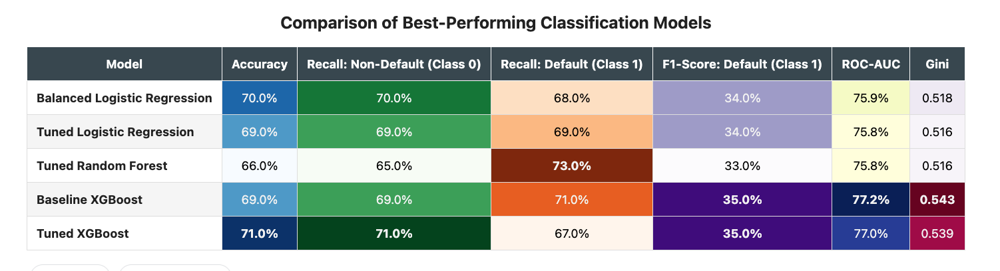

# Loan Default Prediction Using Machine Learning

## Project Overview

Financial institutions face significant losses when borrowers default on loans. The objective of this project was to develop and compare multiple machine learning models capable of predicting loan defaults while addressing the severe class imbalance commonly found in real-world credit risk datasets.

Using the LendingClub loan dataset containing over **2.26 million loan records**, a representative sample of **75,000 loans** was selected for model development to improve computational efficiency while preserving the original class distribution.

The project evaluates several classification techniques, compares their predictive performance, and identifies the most effective model for detecting high-risk borrowers.

---

## Business Problem

Accurately identifying borrowers likely to default enables lenders to:

- Reduce credit losses
- Improve lending decisions
- Better manage portfolio risk
- Balance default detection against false positive predictions

Because only about **12% of loans defaulted**, special techniques were required to overcome the class imbalance problem.

---

## Dataset

- **Source:** LendingClub Loan Dataset (Kaggle)
- Original dataset: **2,260,668 loans**
- Features: **145**
- Sample used for modeling: **75,000 loans**
- Binary target:
  - 0 = Non-default
  - 1 = Default

---

## Project Workflow

- Data loading and exploration
- Data cleaning
- Missing value treatment
- Removal of target leakage variables
- Feature engineering
- Feature encoding
- Exploratory Data Analysis (EDA)
- Train-test split
- Feature scaling
- Machine Learning model development
- Hyperparameter tuning
- Model comparison
- Feature importance analysis
- Final model selection

---

## Machine Learning Models

The following models were developed and evaluated:

- Logistic Regression (Baseline)
- Balanced Logistic Regression
- L1-Regularized Logistic Regression
- Logistic Regression with SMOTE
- Hyperparameter-Tuned Logistic Regression
- Random Forest
- Random Forest with SMOTE
- Hyperparameter-Tuned Random Forest
- XGBoost
- Hyperparameter-Tuned XGBoost

---

## Model Performance



---

## Final Model

The **hyperparameter-tuned XGBoost model** achieved the strongest overall predictive performance and was selected as the final model.

Although Balanced Logistic Regression produced nearly identical results while offering greater interpretability, XGBoost achieved the highest ROC-AUC and the best overall balance between identifying defaulted borrowers and minimizing false classifications.

---

## Technologies Used

- Python
- Pandas
- NumPy
- Scikit-learn
- XGBoost
- Matplotlib
- Seaborn
- Jupyter Notebook

---

## Repository Structure

```
probability-of-default/

│── probability-of-default-pd.ipynb
│── README.md
│── requirements.txt
│── pd_report
│── pd_presentation
│── model_comparison.png

```

---

## Future Improvements

- Train the final model on the complete LendingClub dataset
- Explore additional ensemble methods
- Incorporate model explainability techniques such as SHAP values
- Evaluate temporal validation using out-of-time test sets

---

## Dataset

The LendingClub dataset is publicly available on Kaggle.

Due to dataset licensing and repository size limitations, the dataset is not included in this repository.
